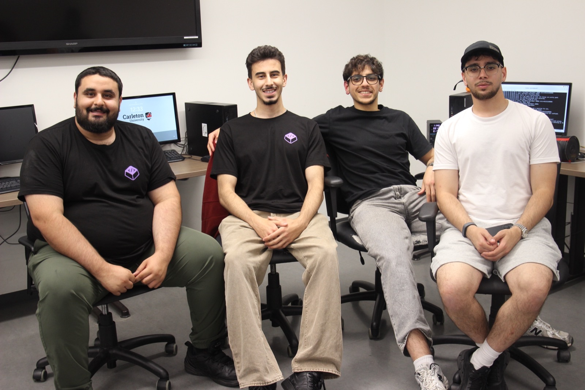
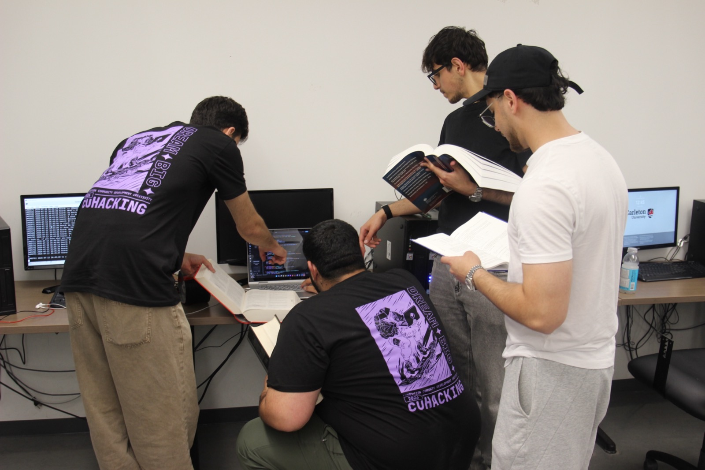
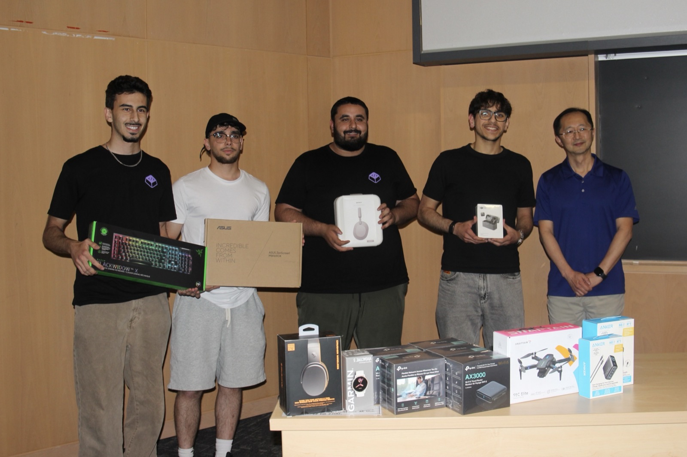
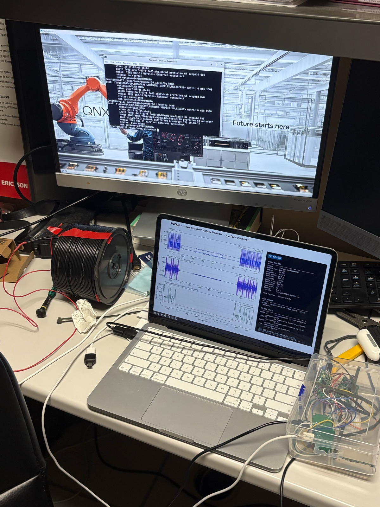

# Rocko

**Cave Explorer Safety Beacon, built for CU Hacking 2026 (QNX Embedded AI Challenge)**

A cave explorer carries Rocko, a handheld device running on a Raspberry Pi 5
under QNX 8. It listens for a spoken emergency, classifies it on device with
TFLite, and sends the result through solid rock to the surface using a
low frequency magnetic field, the same principle real mine rescue beacons use.
A photo based injury classifier runs on the same device for cases where a
camera feed is available. A surface station (a coil sensor wired to a Pico,
plugged into a laptop) decodes the signal and shows what happened, when.

Every few minutes the device also sends a heartbeat, so if the pings stop
arriving, the surface knows something is wrong even if no emergency was ever
spoken. Silence is the alarm.

## Demo

[](https://www.youtube.com/watch?v=b3_v2pcWqy0)

**[Watch the demo on YouTube](https://www.youtube.com/watch?v=b3_v2pcWqy0)** —
wake phrase to on-device classification to a frame decoded at the surface.

## The team at CU Hacking 2026



|  |  |
|---|---|
|  |  |
| **Mid-build**, the live listener log running on the bench monitor | **Awards ceremony**, collecting the hardware |

## How it works

```
EXPLORER DEVICE (Raspberry Pi 5, QNX 8, battery powered)
  USB mic --> whisper.cpp --> wake phrase gate --> classifier --> transmitter
  photo   --> TFLite injury model (8 wound classes)
  GPIO22/17/27 --> L298N driver --> coil --> through rock --> surface sensor

SURFACE STATION (laptop, no second Pi)
  coil sensor --> Pico (ADC, 200 samples/sec) --> USB serial --> laptop
  laptop: live 3 pane dashboard, decoder, numbered event log
```



The rig on the bench: the hand wound coil, the Pi in its enclosure on the
right, and the surface dashboard locked onto a frame mid decode, with QNX on
the monitor behind.

**Wake phrase**: "hey rocko help", followed by what happened. Saying the
phrase alone sends an SOS. Saying "hey rocko help, I am okay" cancels a
pending alert. The wake gate is a single choke point in the code: nothing
transmits before a real classification happens, and unclear or negated
speech never gets read as a false all clear.

**Frame format**: an 8 bit preamble (`01111110`) followed by 4 flag bits,
sent with Manchester encoding on an 8 Hz tone, 1 second per bit. Emergencies
repeat 3 times with 3 second gaps for reliability. A heartbeat (all flags
zero) goes out automatically every 120 seconds. The full code table lives in
[`docs/equipment-codes.md`](docs/equipment-codes.md), this is the contract
between the explorer side and the surface decoder.

## Quickstart

Explorer device, on the Pi over SSH:

```bash
sh rocko.sh
```

One command starts the audio pipeline and the coil transmitter together, with
a numbered, timestamped event log on screen. `sh rocko.sh photo <image>`
classifies a wound photo instead.

Surface station, on the laptop:

```bash
pip install -r receiver/requirements.txt
python3 receiver/rocko_receiver.py
```

The dashboard auto-detects the Pico's serial port, shows both sensors raw,
the 8 Hz filtered signal, and the carrier amplitude with an adaptive
threshold. Decoded frames get a marker and a numbered log entry.

## Repository map

- `TTS/` -- wake phrase gate, emergency classifier (C, compiled on the Pi), live listener script
- `transmitter/` -- coil transmitter daemon, frame encoding, GPIO backend
- `photo/` -- injury photo classifier (TFLite)
- `receiver/` -- surface capture, live dashboard, decoder
- `bench/` -- early hardware bring up scripts and the CNN training script
- `docs/equipment-codes.md` -- the frozen frame contract, both sides build against this
- `docs/adr/` -- why key hardware and protocol decisions were made
- `docs/plan/` -- product requirements, architecture, and build notes
- `docs/images/` -- photos of the build and the event
- `tests/` -- unit tests for the transmitter, receiver, wake gate, photo classifier, and launcher

## Hardware

- Explorer device: one Raspberry Pi 5, QNX 8, USB microphone, L298N motor
  driver wired to a hand wound coil. GPIO22 to IN3, GPIO17 to IN4, GPIO27 to
  ENB, coil on OUT3/OUT4. 12 V only touches the L298N, grounds are shared.
- Surface station: a magnetic sensor wired to a Raspberry Pi Pico (ADC
  digitizer), USB serial to a laptop. No second Pi.

See [`docs/plan/ARCHITECTURE.md`](docs/plan/ARCHITECTURE.md) for the full
wiring diagram and signal chain.

## Link characterization

How much signal actually survives the rock? A separate bench rig answers that:
a transmitter that sends known symbols (A to Z) through the coil, and a coded
receiver that decodes them, so link quality is measured instead of assumed.
This is instrumentation, not the beacon. The emergency path is the 12 bit
frame described above.

Across 30 frames at five transmit duty cycles:

| Duty | Pooled SNR | Layered decoder | Coherent SLNN |
|---:|---:|---:|---:|
| 100% | 3.37 dB | 5/6 | 6/6 |
| 50% | 4.72 dB | 5/6 | 6/6 |
| 25% | 0.18 dB | 3/6 | 6/6 |
| 10% | no positive estimate | 0/6 | 0/6 |
| 1% | -29.49 dB | 0/6 | 0/6 |

The coherent SLNN decoder holds 6/6 down to 0.18 dB, where the simpler layered
decoder falls to 3/6. Below 10% duty nothing decodes. On held out frames the
SLNN generalized on 3 of 5, including one at -2.42 dB when the scheduled frame
boundary was supplied.

Caveat recorded with the run: people walked across the link during some frames
and those frame identities were not logged, so this is a mixed clean and
interference dataset rather than a controlled sweep.

The rig, the decoders, and the full results live on the `task/receiver-v2`
branch ([results](https://github.com/B2707/Rocko-CU-Hacking_2026/blob/task/receiver-v2/docs/wiki/Results-2026-07-16.md)),
built by Mohammad Steitieh.

## Tests

```bash
python3 -m pip install numpy
python3 -m unittest discover -s tests
```

97 tests, no hardware required. The receiver tests decode synthetic waveforms,
the transmitter tests run against a simulation backend.

## License

Proprietary, all rights reserved. Visible for evaluation and judging only.
No permission is granted to use, copy, modify, or distribute this work.
See [`LICENSE`](LICENSE).
